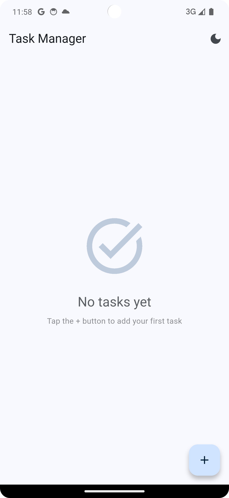
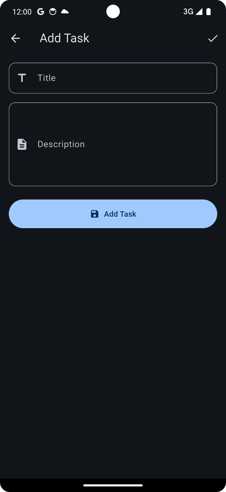
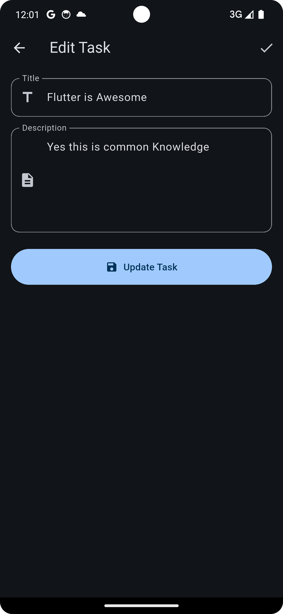

# Flutter Developer Assessment

A simple Flutter app that displays a list of items (tasks) and allows users to **add**, **edit**, and **delete** them.

---

## 🧩 Features

- View a list of tasks on the home screen
- Add a new task using the floating action button
- Edit an existing task by tapping on it
- Swipe to delete a task
- Persistent local storage using **SharedPreferences**
- Light and dark theme toggle
- Clean UI and custom reusable widgets

---

## 🧠 Architecture & State Management

This app follows the **MVVM (Model–View–ViewModel)** architecture pattern combined with **Riverpod** for state management.  
This ensures a clear separation of concerns:
- **Model**: Represents the data layer (task structure and storage).
- **ViewModel**: Handles the app’s business logic and state updates.
- **View**: The UI layer that listens to ViewModel changes.

Using Riverpod within MVVM allows for reactive, maintainable, and easily testable code.

---

## 💾 Storage

Data is persisted locally using **SharedPreferences**, a lightweight key-value storage solution for Flutter.

---

## 🧱 Folder Structure


🛠️ Tools & Libraries Used
Flutter (v3.x)
Riverpod – State management
SharedPreferences – Local data persistence
MVVM architecture – Clean code structure
Material Design – UI styling
intl – DateTime formatting
uuid – Unique ID generation for tasks

| Home Screen                         | Add Item                         | Edit Item                          | Dark Mode                          |
| ----------------------------------- | -------------------------------- | ---------------------------------- | ---------------------------------- |
|  |  |  |  |


```plaintext
lib/
│
├── main.dart             # Entry point
├── models/               # Data models
├── viewmodels/           # Business logic & app state (MVVM)
├── provider/             # Riverpod providers
├── view/                 # App screens (Home, Add/Edit)
├── widgets/              # Reusable custom widgets
└── theme/                # Light & dark theme setup
